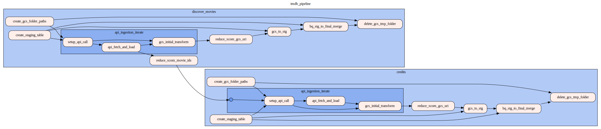

# TMDb Airflow Pipeline

An end-to-end data pipeline built with **Apached Airflow**, **Google Cloud Storage**, and **BigQuery** to extract movie metadata from the [TMDb API](https://developer.themoviedb.org/), store the raw JSON in the cloud, and load transformed structured data into analytics-ready BigQuery tables. 

This project is part of a personal data-analytics portfolio, and demonstrates ETL orchestration in Airflow, using dynamic task mapping, environment-specific configuration, and reusable task modules.


## Project Motivation

I wanted to create a portfolio project that illustrates:
- Modern orchestration patterns in Airflow (dynamic DAGs, task groups, and config-driven design)
- Scalable ingestion of API data to GCS and BigQuery
- Reusable abstrations in Python that make extending to new APIs quick and easy
- End-to-end data lineage: from raw JSON to BigQuery tables, ready for analytics in **dbt**

## Architecture Overview

**Flow summary**
1. **Ingestion**: From TMDb, fetch top revenue-grossing movies by year, and downstream fetch credits for each movie.
2. **Storage**: Upload raw JSON responses (enriched with metadata) to GCS in a standarized folder path.
3. **Transformation**: Extract relevant fields and flatten nested JSON.
4. **Load**: Write data to BigQuery staging tables, then merge into final partitioned tables.

## Design Principles

| Principle | Description |
|---|---|
| **Config‑driven** | Environment & API settings centralized in `config/settings.yaml`, read via `utils/config.py`. |
| **Modular architecture** | Reusable modules for GCS/BigQuery (`core/`), and ETL tasks (`tasks`, `pipeline_utils`). |
| **Dynamic DAGs** | `dags/tmdb_pipeline.py` maps tasks over years and API endpoints. |
| **Reusable tasks and taskgroups** | Consistent API-specific parameters in `schemas/` |


## Repo Structure

```
airflow/
│
├── config/
│   └── settings.yaml               # Environment & API configurations
│
├── core/
│   ├── bq.py                       # BigQuery client, load, and merge helpers
│   ├── gcs.py                      # GCS upload, delete, and path resolution
│   └── env.py                      # Environment variable resolution
│
├── dag_helpers/
│   └── paths.py                    # Dynamically generates GCS paths
│
├── dags/
│   └── tmdb_pipeline.py            # Main Airflow DAG definition
│
├── pipeline_utils/
│   └── transform.py                # JSON transformation utilities
│
├── schemas/
│   └── tmdb.py                     # BigQuery schema definitions
│
├── scripts/                        # Optional CLIs / ad‑hoc jobs
│
├── tasks/
│   ├── ingestion.py                # API ingestion + upload to GCS
│   ├── loaders.py                  # GCS → BigQuery loads + MERGE
│   ├── helpers.py                  # Misc helper tasks (dict merging, etc.)
│   └── transforms.py               # Record‑level transformations
│
├── utils/                          # Shared utilities (e.g., config loader)
│
├── docker-compose.yaml             # Local Airflow environment
├── requirements.txt                # Python dependencies
└── .env.example                    # Template for environment variables
```

> The structure above may evolve, but the main idea is a separation of concerns: Airflow orchestration is simple, with core data-layer code living in reusable modules.

## DAG Overview

**DAG ID**: `tmdb_pipeline`
**Core logic**:

The following occurs twice in the DAG, first for the `discover_movies` endpoint, and then again for the `credits` endpoing

1. **Discover movies by year** & **Credits**
    - Dynamically fetches top-revenue-grossing movies in year year from the TMDb API
    - Movie IDs are saved to XCom and referenced downstream to collect credits data
2. **Upload to GCS**
    - Store API call's data as a JSON blob under a standardized GCS folder structure:
      ```
      tmdb_pipeline/tmdb/{api_endpoint}/
      ```
3. **Transform & stage**
    - Apply (light) transformations and load to BigQuery staging table
4. **Merge into final table**
    - Upsert clean data into BigQuery table, ready for analytics with dbt.




## Local Setup

### 1) Clone the repo
```bash
git clone https://github.com/mickysoulesteinberg/airflow.git
cd airflow
```

### 2) Configure environment
Create a `.env` from the example:
```bash
cp .env.example .env
```

Then set your variables:
```env
GCP_PROJECT_ID=your-gcp-project-id
TMDB_API_KEY=your-tmdb-api-key
ENV=dev
```

- Set your bucket in `config/settings.yaml` under the chosen environment:
  ```yaml
  environments:
    dev:
      gcs_bucket: your-dev-bucket
    prod:
      gcs_bucket: your-prod-bucket
  ```

### 3) Start Airflow (Docker)

```bash
docker compose up
```
Airflow UI: http://localhost:8080

### 4) Trigger the DAG
In the UI:
```bash
docker compose exec airflow-scheduler airflow dags run tmdb_pipeline
```
The DAG accepts a YEARS parameter, you can pass a list (e.g., `[2003, 2004]`).

## Future Improvements

- Include dbt models for downstream transformations.
- Integrate SSA baby naming data for analytics of naming trends with popular actors and characters.
- Integrate TMDb **`/people`** and **`/genres`** endpoints for richer analytics.
- Add a status table to checkpoint runs and record load metadata

## Author

**Micky Soule Steinberg, PhD**  
Analytics Engineer - Data Engineering/Analytics Portfolio  
GitHub: https://github.com/mickysoulesteinberg  
LinkedIn: https://www.linkedin.com/in/micky-soule-steinberg